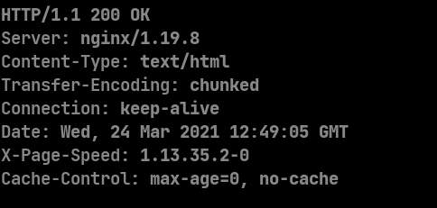

# Cách cài đặt module pagespeed đơn giản nhất đến trẻ con cũng có thể làm được trên CentOS 7
Hiện nay có 2 web server thông dụng nhất đó là nginx và apache. Bài hôm nay sẽ hướng dẫn cách cài đặt module pagespeed của google cho cả 2 web server. Module này hỗ trợ cho việc tối ưu mã html trên trinh duyệt và đo được performance của website.

# 1. Cài đặt module pagespeed cho apache
Đầu tiên thì máy đã được cài apache làm web server đã. Cách kiểm tra: Nhập lệnh **systemctl status httpd** để xem thử đã cài đặt apache chưa. Nếu chưa thì cài đi nhé.
Module pagespeed trong apache được gọi là mod_pagespeed. Có thể được cài đặt một cách cực kì đơn giản qua các bước sau:
 Kiểm tra thử wget đã được cài đặt chưa. 
 
 Chưa được cài đặt thì cài đi nhé. Sau đó nhập các lệnh sau:
  > yum install at -y (Package cần cho khi cài đặt module pagespeed)
  >
  >  cd /tmp
  >
  > wget https://dl-ssl.google.com/dl/linux/direct/mod-pagespeed-stable_current_x86_64.rpm
  > 
  > rpm -U mod-pagespeed-*.rpm

Thế là ta đã cài đặt xong module pagespeed cho apache. Ta có thể kiểm tra bằng cách xử dụng câu lệnh **curl -I -X GET test.com** (Với test.com là domain để test). Trong HEADER được trả về ta thấy có dòng **X-Mod-Pagespeed** thì ta có thể thấy được mod_pagespeed được cài đặt thành công.

# 2. Cài đặt module pagespeed cho nginx
Vì không thể cài đặt module pagespeed cho nginx bằng các package manager nhưng may mắn rằng google đã tó tool auto để làm tất cả mọi thứ cho chúng ta
Để cài đặt module pagespeed cho nginx ta có thể làm theo các bước sau:
 
  Tải và chạy file cài đặt tự động của google:
   > yum install openssl-devel (Cài đặt SSL)
   > 
   > bash <(curl -f -L -sS https://ngxpagespeed.com/install) --nginx-version latest
   > 
  Chương trình sẽ tự động tải về và quá trình cài đặt được thực hiện một cách tự động và các tool để cài bị thiếu thì trong quá trinh cài đặt cũng sẽ được hỏi chỉ việc nhập **y** như trong hình.

  Tùy vào như cầu mỗi người thì đoạn này sẽ là thêm các config vào hoặc nhấn **Enter** để tiếp tục

  Xác nhận cài đặt lần cuối cấu trúc thư mục. Nhập **y** rồi làm cốc nước chờ chương trình tự động compile rồi cài đặt thôi.

 Đây là thông báo sau khi cài đặt xong

 Để có thể sử dụng module pagespeed thì cần phải thêm những option nhỏ vào nginx.conf dưới từng block **server** cần xử dụng module pagespeed. Theo như ví dụ dựa theo hình ở trên thì phải thêm vào file có đường dẫn là **/usr/local/nginx/conf/nginx.conf** những option là: 
   >pagespeed on;
   >
   > #Needs to exist and be writable by nginx.  Use tmpfs for best performance.
   > 
   > pagespeed FileCachePath /var/ngx_pagespeed_cache;
   >
   > #Ensure requests for pagespeed optimized resources go to the pagespeed handler
   > 
   > #and no extraneous headers get set.
   > 
   > location ~ "\.pagespeed\.([a-z]\.)?[a-z]{2}\.[^.]{10}\.[^.]+" {
   > 
   > add_header "" "";
   > 
   > }
   >  
   > location ~ "^/pagespeed_static/" { }
   > 
   > location ~ "^/ngx_pagespeed_beacon$" { }
   > 

 
 Để có thể chạy nginx được build bởi tool của module pagespeed thì ta chỉ cần chạy câu lênh:
 > /usr/local/nginx/sbin/nginx -c /usr/local/nginx/conf/nginx.conf
 > 
 Kiểm tra lại bằng câu lệnh sau **curl -I -X GET test.com**(Ví dụ ở đây là trang web có domain là test.com được tạo để kiểm tra thử) ta sẽ thấy được trong HEADER được trả về sẽ có dòng **X-Page-Speed** đó là module pagespeed đã được cài thành công

# Tổng kết lại
 Sau bài này hi vọng mọi người sẽ có thể biết cách cài đặt tổng quát nhất module pagespeed cho cả 2 loại web server là nginx và apache.
 
## Tài liệu tham khảo
https://www.modpagespeed.com/doc

https://unix.stackexchange.com/questions/243060/unable-to-install-mod-pagespeed-on-apache-2-4
